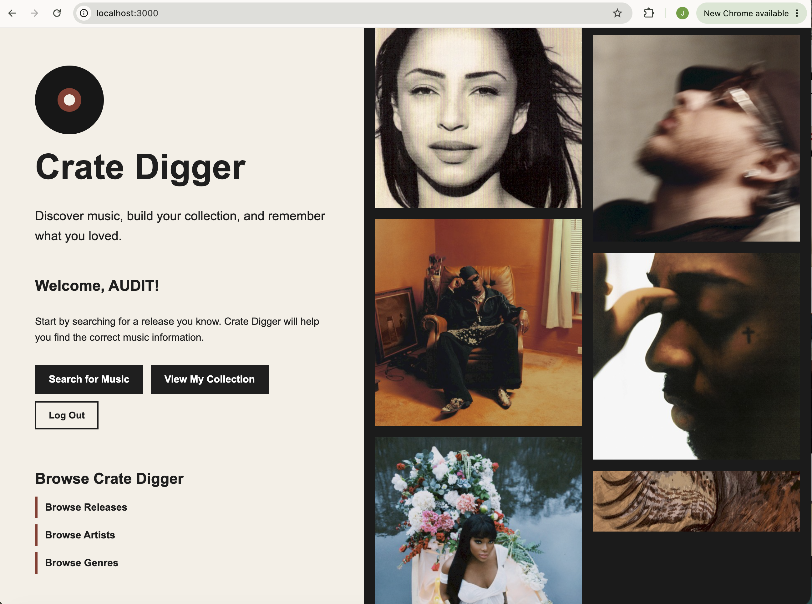

# Crate Digger V2

Crate Digger V2 is a Ruby on Rails music discovery and collection application. Users can search for artists and releases using MusicBrainz, save releases to a personal collection, organize music by genre, and rate and review releases.

Users can browse Crate Digger without an account, while creating, saving, reviewing, and managing music requires an account.



## Setup Instructions

Clone the repository:

```bash
git clone git@github.com:Brick5g/phase-4-project-Crate-Digger-V2.git
```

Move into the project directory:

```bash
cd phase-4-project-Crate-Digger-V2
```

Install the required gems:

```bash
bundle install
```

Create the development and test databases:

```bash
bin/rails db:create
```

Run the database migrations:

```bash
bin/rails db:migrate
```

Seed the database with the starter genres:

```bash
bin/rails db:seed
```

Run the test suite:

```bash
bundle exec rspec
```

Run RuboCop:

```bash
bin/rubocop
```

Start the Rails server:

```bash
bin/rails server
```

Open the application in your browser at:

```text
http://localhost:3000
```

To stop the Rails server, press:

```text
Control + C
```
